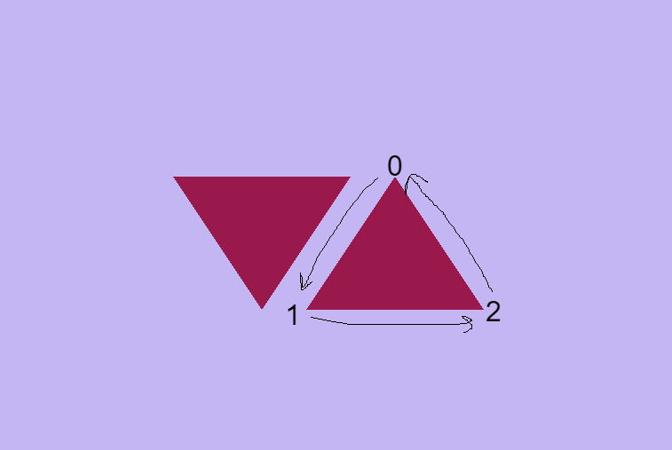
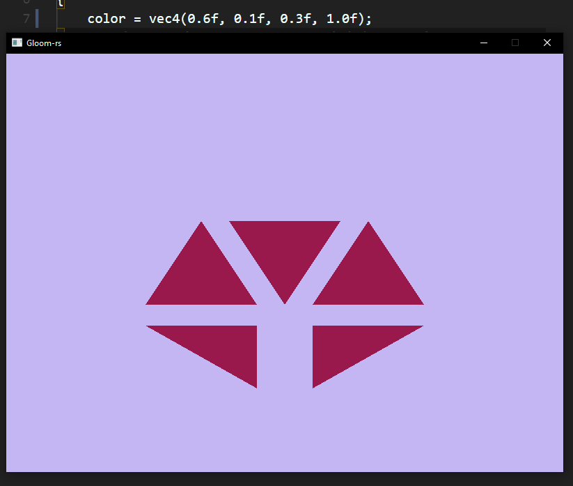
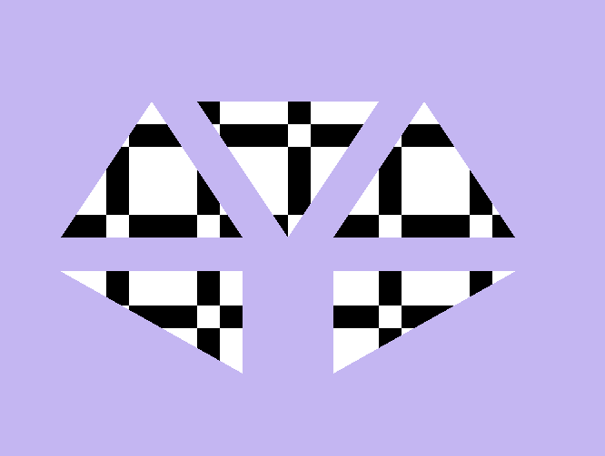

<!--
This is a HTML-style comment, not visible in the final PDF.
-->

# Assingment 1

## Task 1c

Drawn 5 triangles on the screen as shown above.

## Task 2a

As seen in the picture this triangle is but off at the corners. This is because of a phenomenon called Clipping, a part of the graphics pipeline and is used to remove elements outside of the viewport. In this case the viewport is restriced within ${x, y, z} = [-1f, 1f]$ and since the z-index for the verteces $v_0$ and $v_2$ is past this restriction they are cut off. The reason for this is to make sure objects outside of the viewport is not rendered and save resources. 

## Task 2b

When using `gl::DrawElements` with `mode=gl::TRIANGLES` OpenGL takes the first three vertecis and creates a triangle, and then to the next three vertecis and so on. The vertecies are defined by the index buffer and can be changes so that instead of building a triangle with $v_{0, 1, 2}$, we can build a triangle using $v_{0, 2, 1}$. By doing this we change the direction of the drawn triangle. Since `gl::Enable(gl::CULL_FACE)` is enabled we need to draw the triangles in a counter-clockwise direction as shown in the image above. If we build the trangle using $v_{0, 2, 1}$ we would build the triangle clockwise and we experience back face culling as shown here:
.

## Task 2c
### i
The depth buffer contains the depth of each pixel. These depths are used to calculate the depth of the next pixel and so on. If the filter is not cleared each iteration the pixels will be compared to the previous frame and that does not make any sense. Therefor you should cleare the depth buffer for each frame.

### ii
In the case that there are multiple objects layered on one top off one another. Assuming these objects have different colors the fragment shaders needs to change the pixel to adjust the new object

### iii
The two most common shaders are Vertex and Fragment shaders. The Vertex shaders job is placing is processing the vertecis and actually drawing the objects. The Fragment shaders job is filling the fragments/pixels with colors.

### iv
Using an index buffer saves a lot of memory since vertecis can be reused and draw multiple triangles using the same vertecis. At the same point you can redraw a frame with the same vertecis just by changing the index buffer. This is both resource efficent and saves power.

### v
The reason we pass a null pointer into `VertexAttribPointer` is because the data bound to the `ArrayBuffer` is only vertecies. If we instead push an object with a vertex property and a color property we would not need a offset for the vertex property since its the first data in the object. However if we want to access the color property instead we would need to offset the pointer to the color property on the data (jumping over the vertex property). This can be used to create a triangle with a gradien, where the first `VertexAttribPointer` does not need an offset since it by default will access the vertex, and the second `VertexAttribPointer` will have an offset of `(void*)(sizeof(VERTEX_DATA_TYPE))`. 

## Task 2d

### i

This effect is accomplished by changing the `simple.vert` file , where the `gl_Position` takes a `vec4` containing the position of the scene. Here we can invert the $x$ and $y$ position to mirror the scene both vertically and horizontally compared to the image in Task 1c.

### ii

This effect is accomplished by changing the `simple.frag` file, where the `color` takes a `vec4` containing the rgba-value of the triangles. Changing these variables will change the color as shown above.

## Task 3a

Gave the shader an offset of 4 of 2 to create a more interesing looking pattern.

## Task 3b

Cicle created with Line_Strip

Circle created with Triangle_Fan

Circle created with Line_Strip but in a more "interesting" way using cross coordinates

## Task 3c

Spiral created with incrementing r using sqrt()

## Task 3g

Simple sin function 
