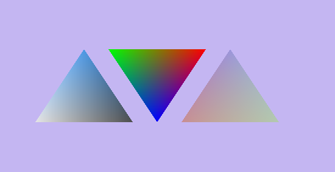
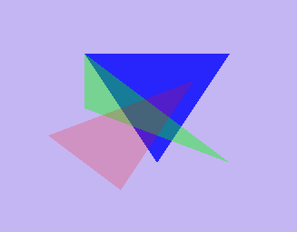
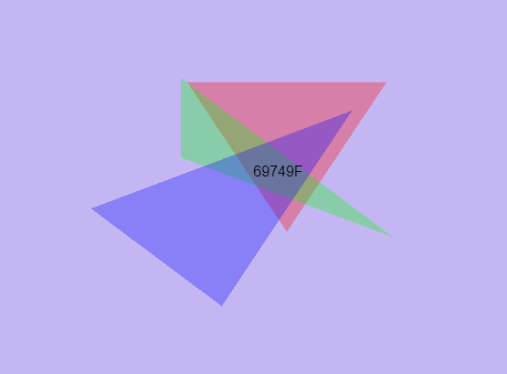
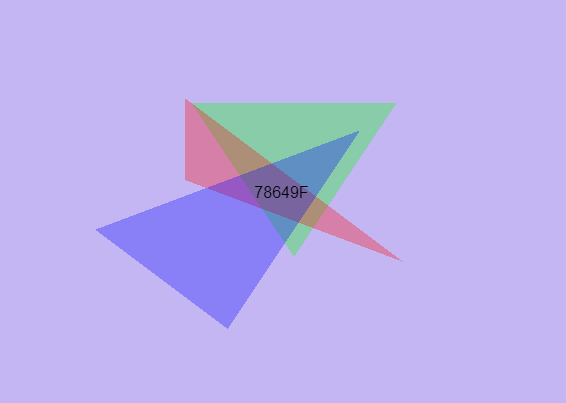
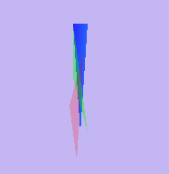
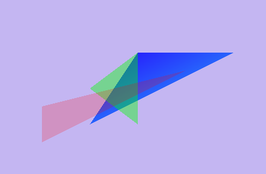
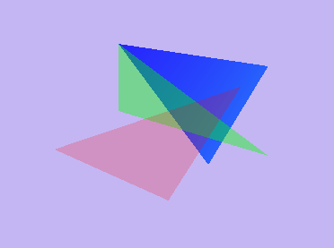
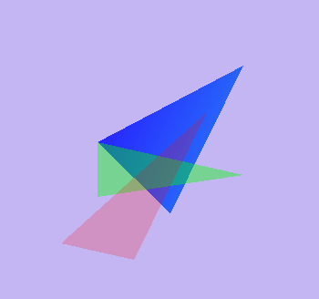
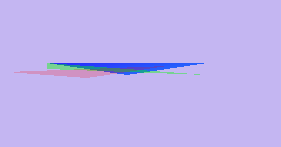
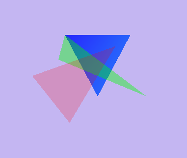

<!--
This is a HTML-style comment, not visible in the final PDF.
-->

# Assignment 2

## Task 1

Drawn 3 triangles with different colors.

## Task 2a

Showing alpha blending with RBG triangles.

## Task 2b

### i

As you can see in the two figures, I have swaped the colors on two of the triangles and as you can see the overlapping colors have changed. This is because of what color is closest to the screen and because of the opacity difference. 

### ii

By changing the depth the triangles where drawn I observed that  some of the colors where not blending. By having the first triangle drawn closest to the camera and the second triangle drawn further out the blend effect disappeared. This is likely because when the second triangle is drawn the first triangle does not get updated with the new background color and therefor there is no color blending effect. This is caused because the depth buffer is perferming a depth test where it is testing if there are elements below an already drawn fragment. If so these fragmens will get discarded an that is why they are not blended with the other colors.  

## Task 3b

### a

By changing the [0][0] value we are scaling the object in the x-axis. This is a quite simple transformation.

### b

By changing the [1][0] value we are shearing along the x-axis.

### c

By changing the [3][0] value we are translating the object along the x-axis. This effects causes the edges of the object to appear bigger and gives an effect of depth.

### d

By changing the [0][1] value we are shearing the object along the y-axis.

### e

By changing the [1][1] we get the same effect as parameter a. Where there is scaling of the object along the y-axis.

### f

Finally by changing the [3][1] value we translating the object along the y-axis.

## Task 2c

We can be certain that none of the transformation where rotation because rotation along an axis needs mulitple variables in the matrix to change. These variables are prefered to be sin and cos of an angle. Since task 2b specificly asked to only change a single variable at a time, we can be sure that the object didn't rotate.

## Task 4

This task does not require a section in the report, however im going to explain the keybindings and some of my thought when solving this task.

The Keybindings are as follows:
| Key | Description                 | Key   | Description                   |
|-----|-----------------------------|-------|-------------------------------|
| W   | upwards along y-axis (-y)   | Up    | rotate upwards along x-axis   |
| A   | right along x-axis (+x)     | Left  | rotate left along y-axis      |
| S   | downwards along y-axis (+y) | Down  | rotate downwards along x-axis |
| D   | left along x-axis (-x)      | Right | rotate right along y-axis     |
| Q   | zoom in towards object (+z) | E     | zoom away from object (-z)    |

I solved this task by creating a structure with the attributes {x, y, z, angle_x, angle_y} which is the position and angle of the camer. By changing these values we can move the camera along all the major axis and rotate along its own axis. This effect can be changed to rotate the camera around the object by swapping the order the transformations matrices are joined.  