<!--
This is a HTML-style comment, not visible in the final PDF.
-->

# Assignment 3

## Task 1c

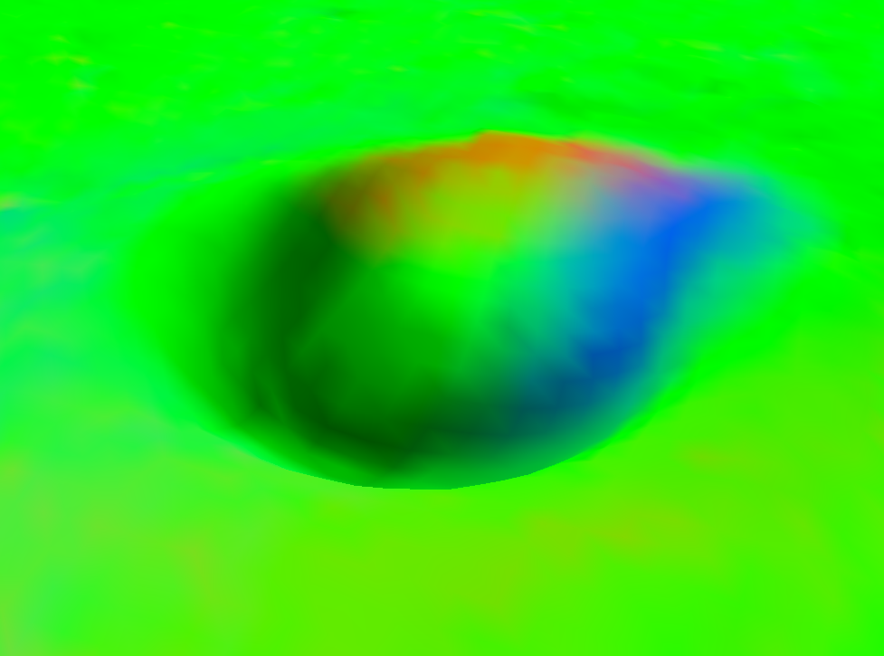

Terrain with rgb colors

## Task 1d

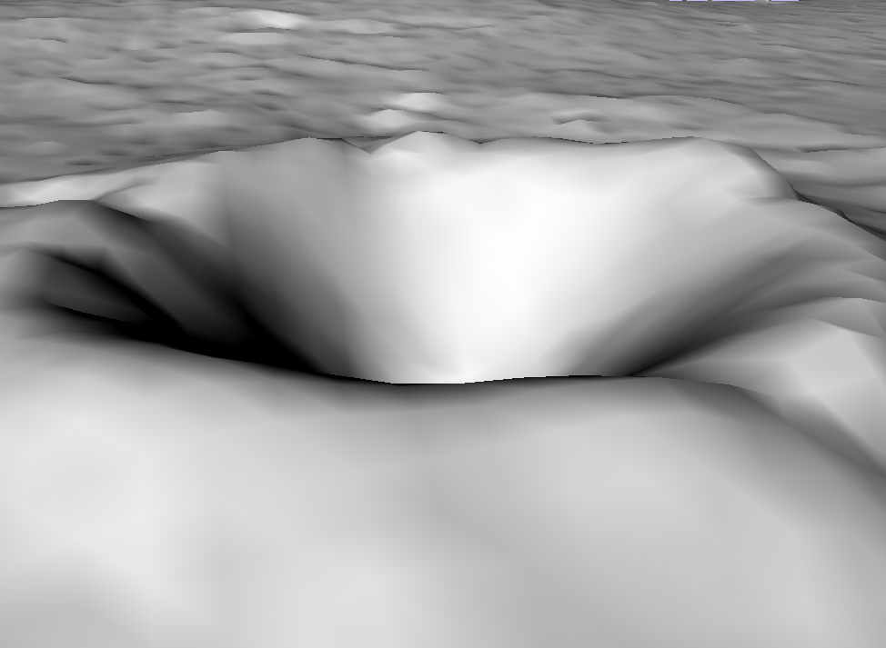

Terrain but instead of rgb colors we are using the normal vertices to shade the terrain.

## Task 2c

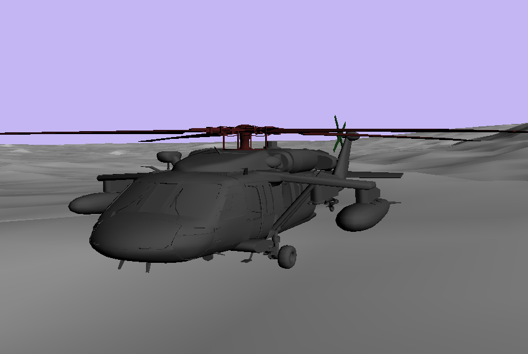

Rendered helicopter in terrain.

## Task 5a

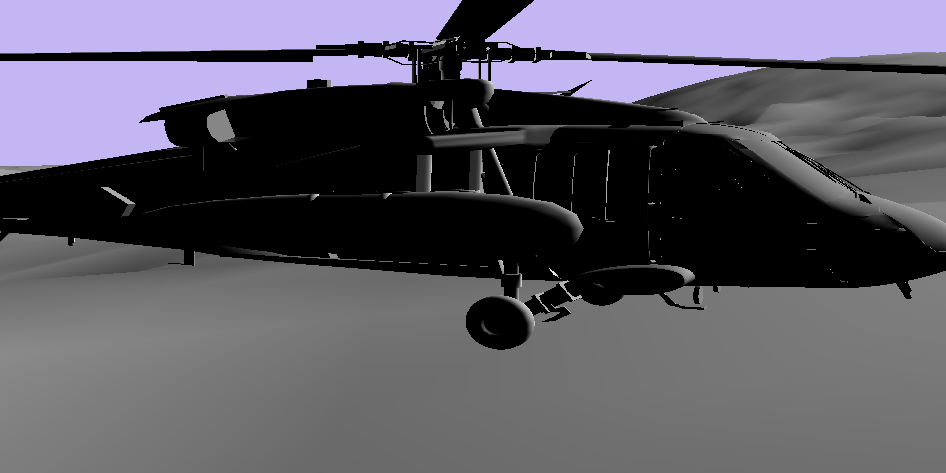

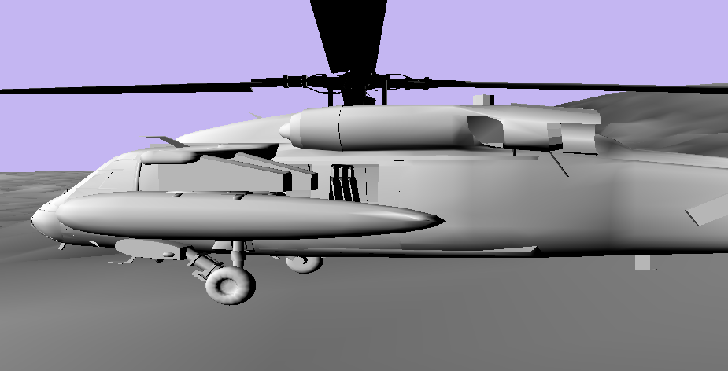

Helicopter rendered without rotated normal vertices, both left and right side. The dark shades are a lot stronger when the vertices are not rotated.

## Task 5c

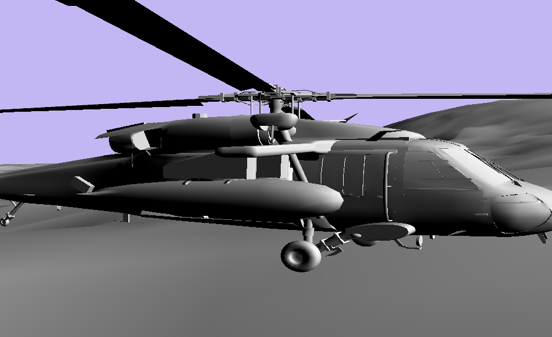

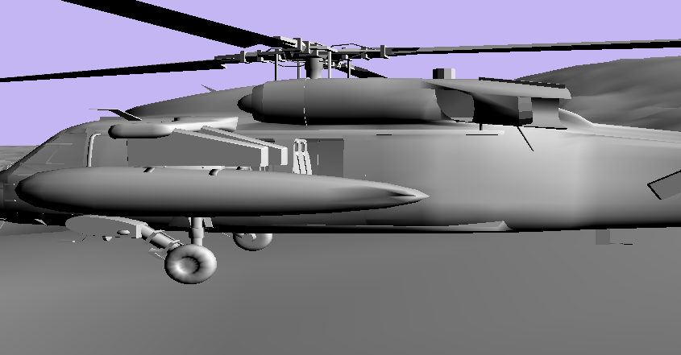

Helicopter rendered with rotated normal vertices, both left and right side. A lot more natural lighting on both sides.

## Task 6a

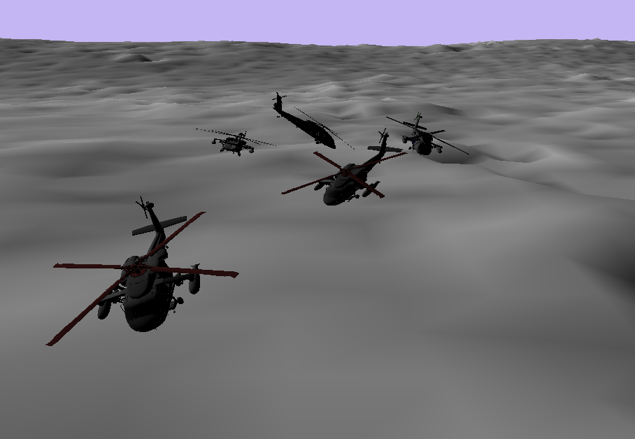

Rendered 5 helicopters with offset to get 5 helicopters following each other :D

## Task 7d

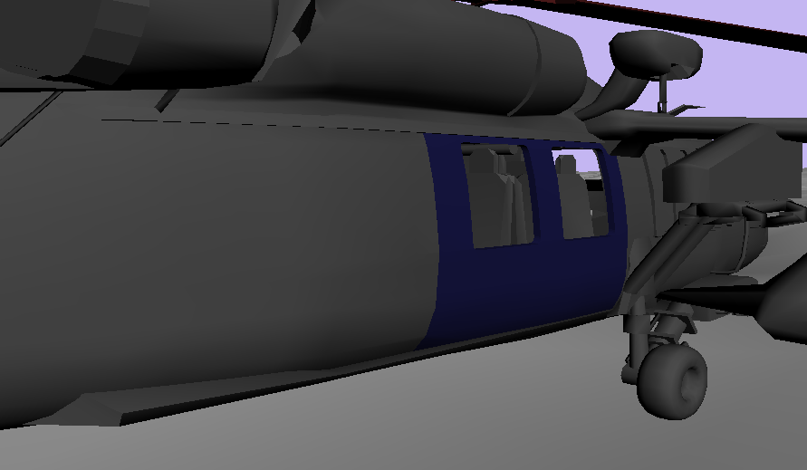

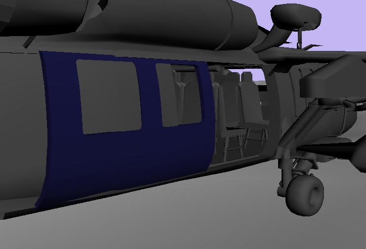

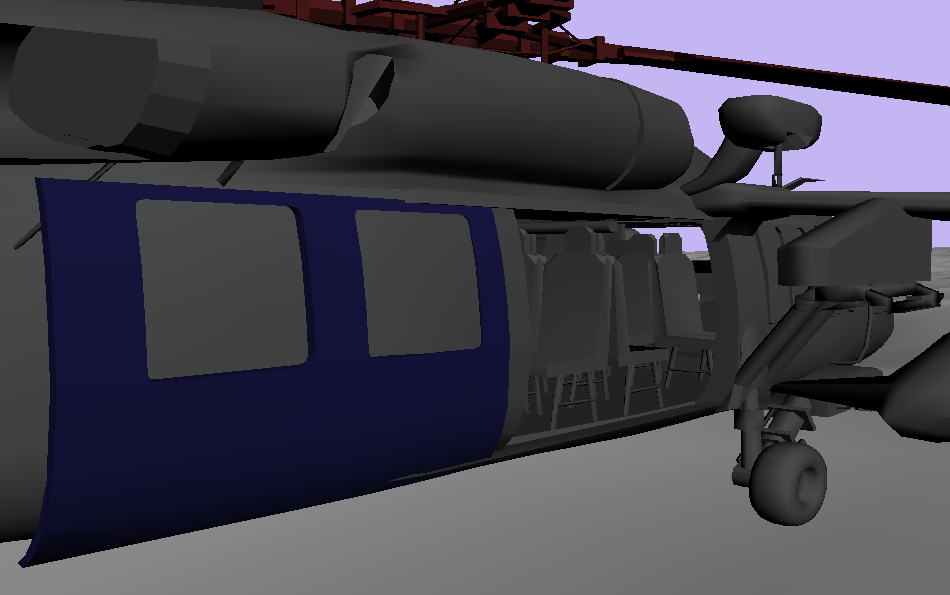

By using the `x` and `z` buttons you are able to open and close the helicopter doors with a sliding animation.

## Task 7f

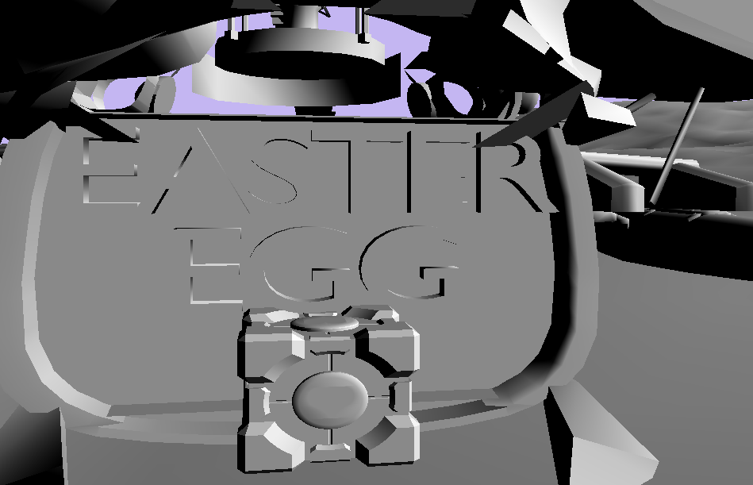

The easter egg is hidden within the helicopter cargo hold.