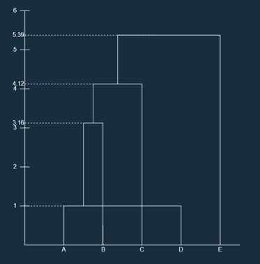
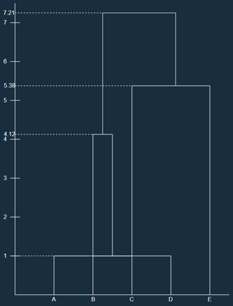
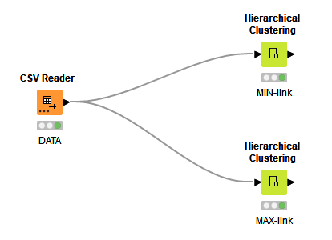
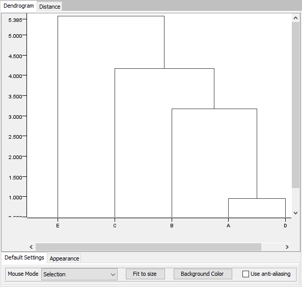
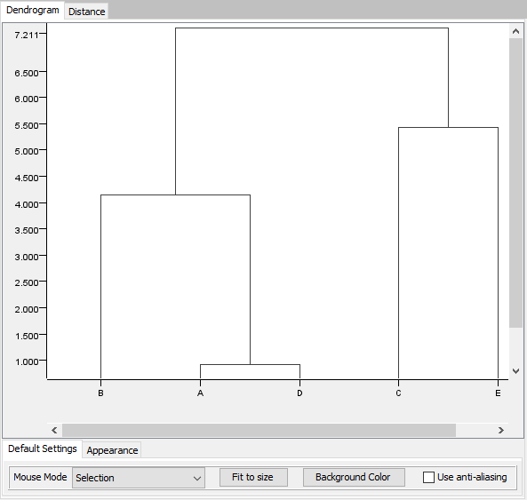
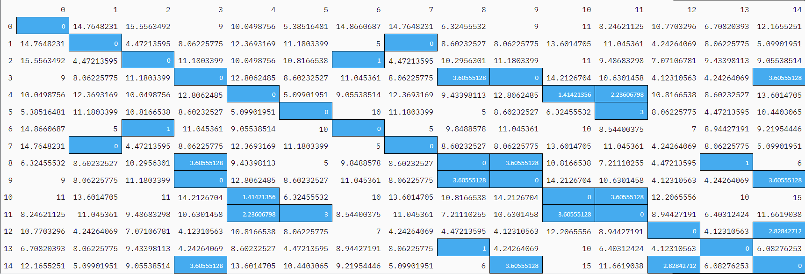
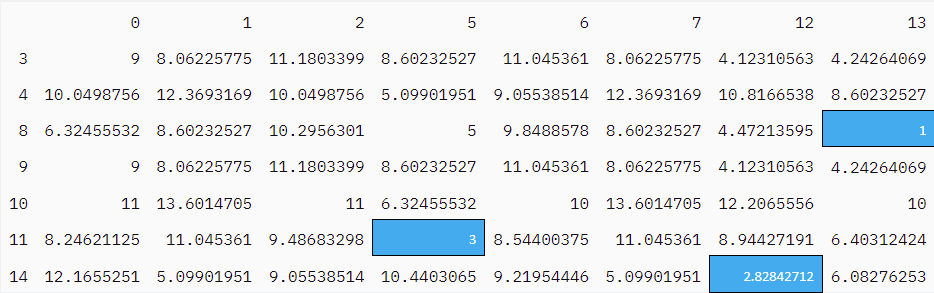
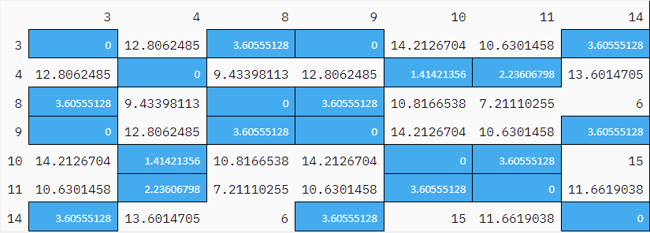
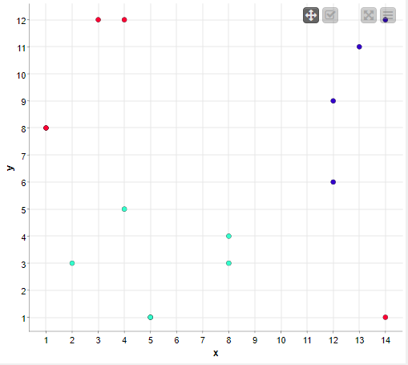

# Task 2
## Task 2a
HAC is mainly used to keep track of the distance between clusters using a nested heirarchical structure. Then joining the closes clusters to create larger clusters defining cluster groups. HAC is done by calculating distance between every point and keep track of this in a matrix. Then the two closest points are merged and and the process is repeted until we have a single cluster. To calculate the distance we can use MIN-link, the smallest distance between two points from each cluster, or MAX-link the furthest distance between two points from each cluster.

## Task 2b
### MIN-link
We begin by calculating the inital distance
|   	| A 	| B 	| C 	| D 	| E 	|
|---	|---	|---	|---	|---	|---	|
| A 	| 0 	| 4.12310563 	| 4.12310563 	| **1** 	| 7.21110255 	|
| B 	| 4.12310563 	| 0 	| 7.07106781 	| 3.16227766 	| 7 	|
| C 	| 4.12310563 	| 7.07106781 	| 0 	| 4.47213595 	| 5.38516481 	|
| D 	| **1** 	| 3.16227766 	| 4.47213595 	| 0 	| 6.70820393 	|
| E 	| 7.21110255 	| 7 	| 5.38516481 	| 6.70820393 	| 0 	|

Next we find that cluster A and D are closest and merge these clusters with smallest distance value. The next iteration is calculated...

|   	| A, D 	| B 	| C 	| E 	|
|---	|---	|---	|---	|---	|
| A, D 	| 0 	| **3.16227766** 	| 4.12310563 	| 6.70820393 	|
| B 	| **3.16227766** 	| 0 	| 7.07106781 	| 7 	|
| C 	| 4.12310563 	| 7.07106781 	| 0 	| 5.38516481 	|
| E 	| 6.70820393 	| 7 	| 5.38516481 	| 0 	|

We can then merge cluster AD with B to get
|   	| A, B, D 	| C 	| E 	|
|---	|---	|---	|---	|
| A, B, D 	| 0 	| **4.12310563** 	| 6.70820393 	|
| C 	| **4.12310563** 	| 0 	| 5.38516481 	|
| E 	| 6.70820393 	| 5.38516481 	| 0 	|
Next we merge cluster ABD with C to get the final assosiation matrix

|   	| A, B, C, D 	| E 	|
|---	|---	|---	|
| A, B, C, D 	| 0 	| **5.38516481** 	|
| E 	| **5.38516481** 	| 0 	|

We can from this create a dendogram showing the merge steps:

### MAX-link
We start by using the same generated table as in MIN
|   	| A 	| B 	| C 	| D 	| E 	|
|---	|---	|---	|---	|---	|---	|
| A 	| 0 	| 4.12310563 	| 4.12310563 	| **1** 	| 7.21110255 	|
| B 	| 4.12310563 	| 0 	| 7.07106781 	| 3.16227766 	| 7 	|
| C 	| 4.12310563 	| 7.07106781 	| 0 	| 4.47213595 	| 5.38516481 	|
| D 	| **1** 	| 3.16227766 	| 4.47213595 	| 0 	| 6.70820393 	|
| E 	| 7.21110255 	| 7 	| 5.38516481 	| 6.70820393 	| 0 	|

Now we merge A and D but instead of keeping the smallest distance we select the largest distance value

|   	| A, D 	| B 	| C 	| E 	|
|---	|---	|---	|---	|---	|
| A, D 	| 0 	| **4.12310563** 	| 4.47213595 	| 7.21110255 	|
| B 	| **4.12310563** 	| 0 	| 7.07106781 	| 7 	|
| C 	| 4.47213595 	| 7.07106781 	| 0 	| 5.38516481 	|
| E 	| 7.21110255 	| 7 	| 5.38516481 	| 0 	|

And we continue these iterations till we have 1 cluster
|   	| A, B, D 	| C 	| E 	|
|---	|---	|---	|---	|
| A, B, D 	| 0 	| 7.07106781 	| 7.21110255 	|
| C 	| 7.07106781 	| 0 	| **5.38516481** 	|
| E 	| 7.21110255 	| **5.38516481** 	| 0 	|

Finally we get 
|   	| A, B, D 	| C, E 	|
|---	|---	|---	|
| A, B, D 	| 0 	| **7.21110255** 	|
| C, E 	| **7.21110255** 	| 0 	|

The dendogram looks like this:

## Task 2c
Workflow:

Min-link:

Max-link:

# Task 3
## Task 3a
We start by calculating the distance between each point and finding points that are close to 3 other points including self with max distance of 4

We then get that the core poinst are [3, 4, 8, 9, 10, 11, 14]

Next we compare the core points with every other point to get border points.

Then we find that [5, 12, 13] are border points

That also concludes that [0, 1, 2, 6, 7] are noise points

We can then find which of the core points are close to each other to merge them into one cluster

Where we finally get 2 clusters

| Cluster 1 | Cluster 2 |
| --------- | --------- |
| 3         | 4         |
| 8         | 10        |
| 9         | 11        |
| 14        | 5         |
| 12        |           |
| 13        |           |

## Task 2b
Workflow:

Plot:

Here we can see cluster 1 in light blue, cluster 2 in purple and the noise as red.